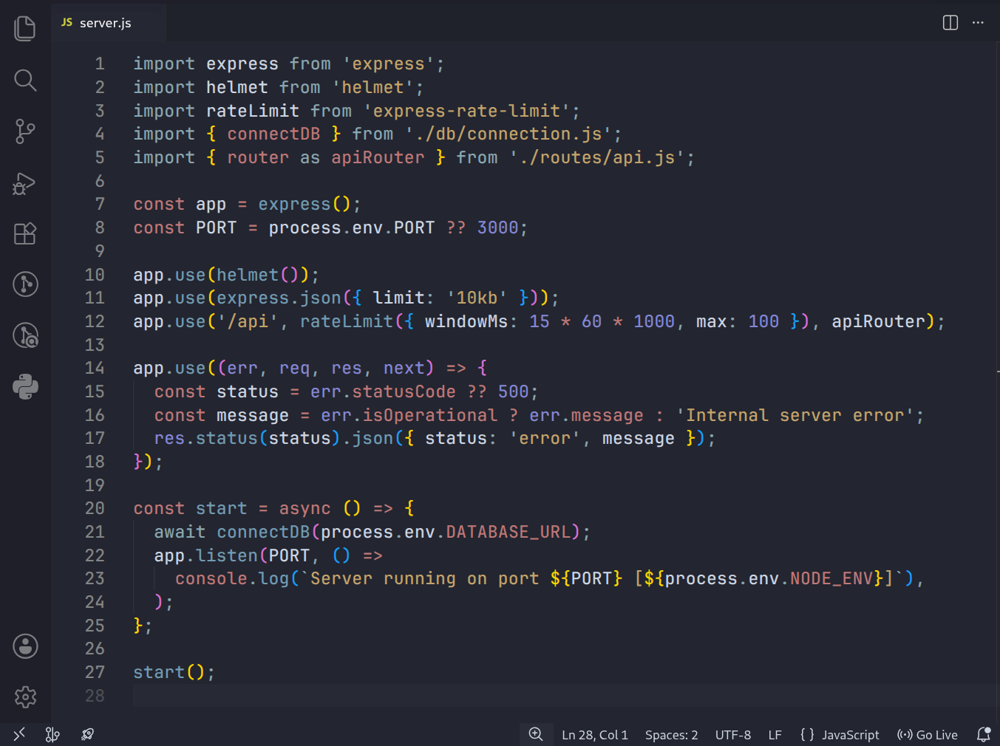
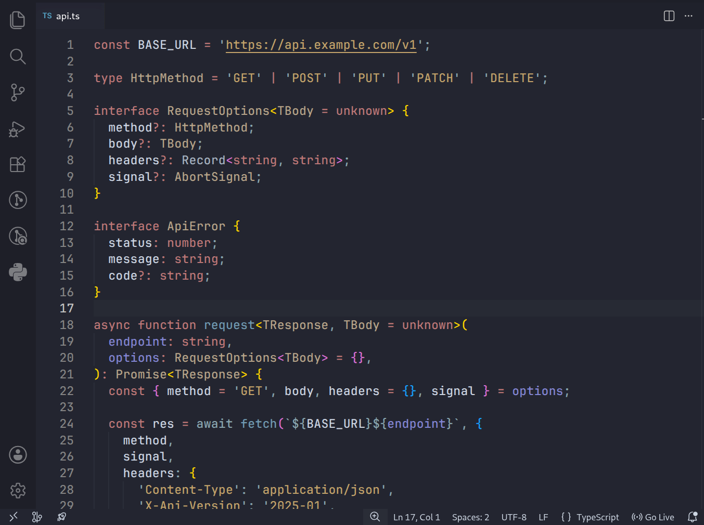
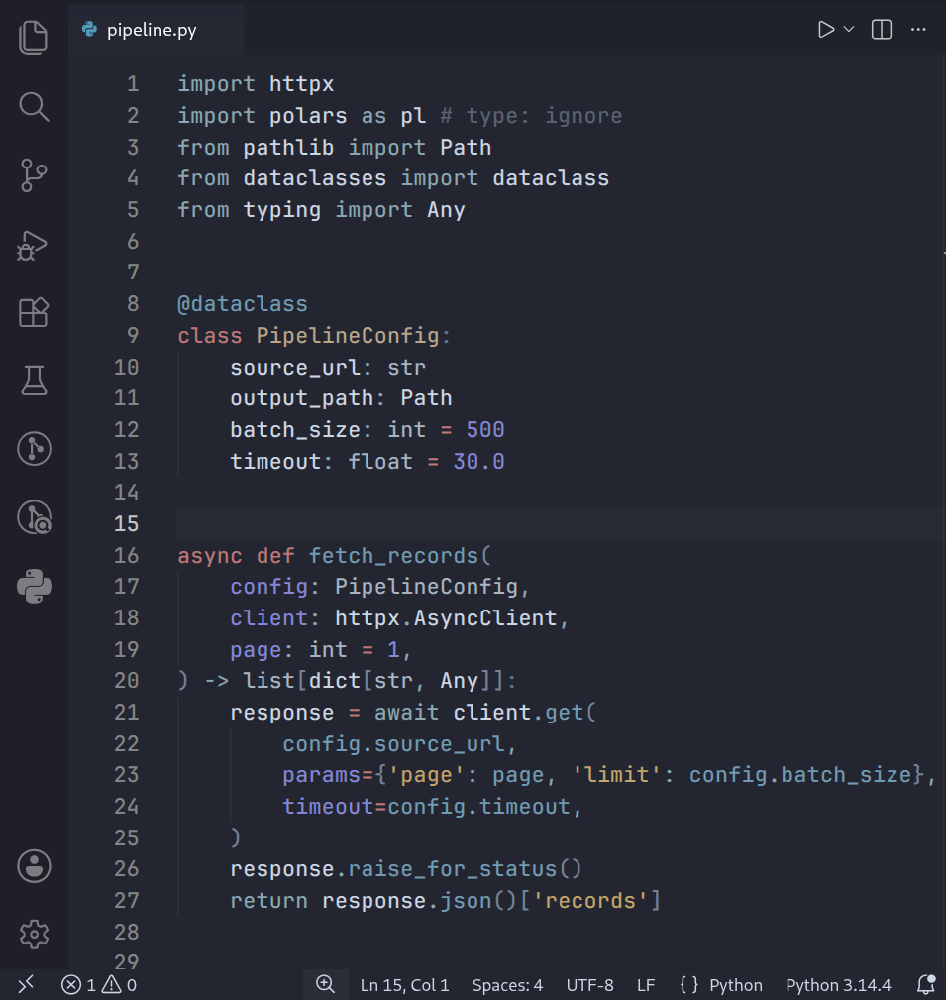
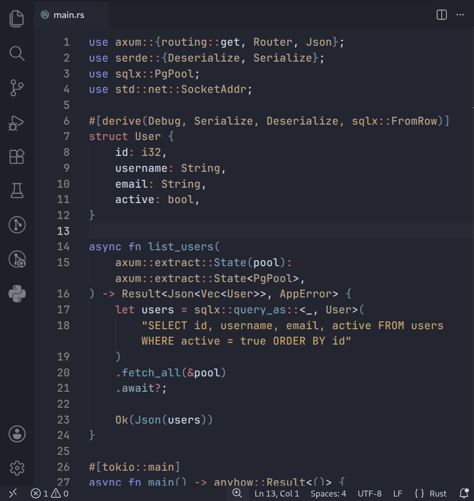
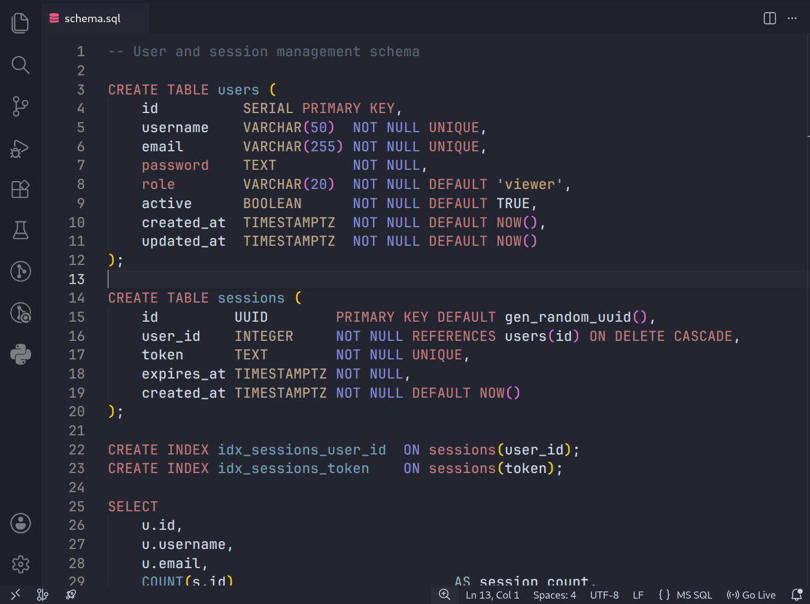
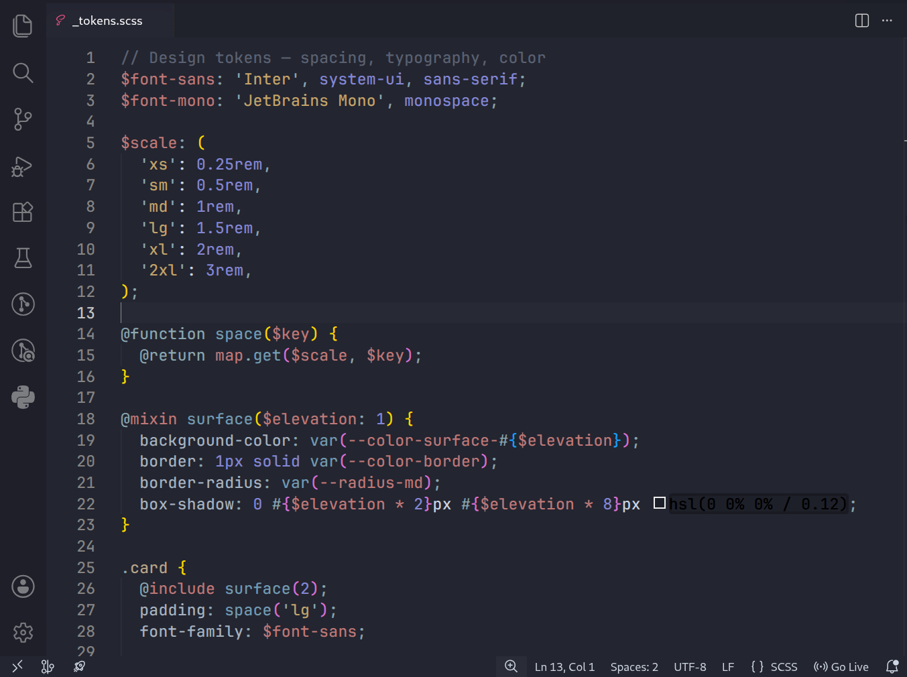
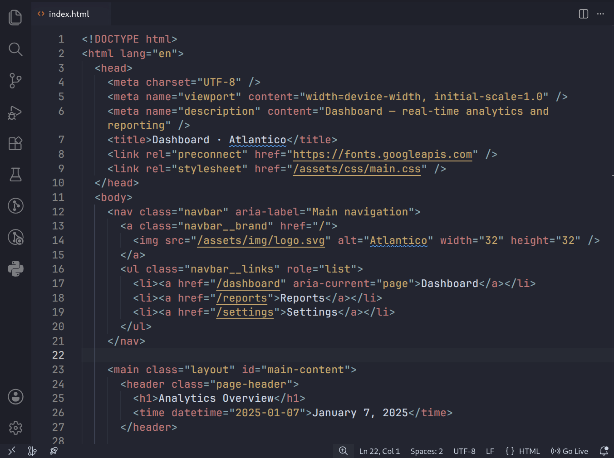
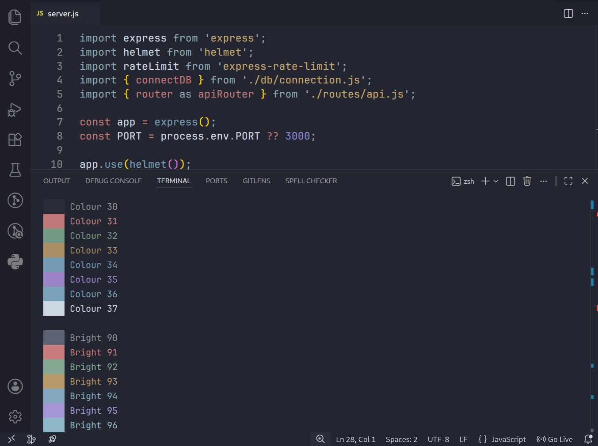

# 🌊 Atlantico

> A premium dark theme for Visual Studio Code — crafted for long coding sessions, reduced eye strain, and visual clarity across a wide range of languages.

---

## 🌌 Features

- Soft ocean-inspired palette
- Reduced eye strain for long coding sessions
- Unified editor + terminal ANSI colours
- Carefully tuned semantic highlighting
- Wide language support
- Low-noise UI design

---

## 📸 Screenshots

<table>
  <tr>
    <td></td>
    <td></td>
  </tr>
  <tr>
    <td></td>
    <td></td>
  </tr>
  <tr>
    <td></td>
    <td></td>
  </tr>
  <tr>
    <td></td>
    <td></td>
  </tr>
</table>

---

## ✨ Why Atlantico?

Most dark themes are built for visual impact. Atlantico was built for **endurance**.

Designed for developers with **astigmatism, eye strain, or light sensitivity**, every colour decision in Atlantico was made to reduce fatigue without sacrificing readability. The palette avoids oversaturated neons and harsh whites in favour of soft, ocean-inspired tones that your eyes can rest on for hours.

- **Low visual noise** — muted backgrounds, subtle UI chrome, nothing competing for attention
- **Calibrated contrast** — readable without being aggressive
- **Semantic colour logic** — consistent token roles across all languages, so your brain learns the pattern once
- **Unified experience** — editor and integrated terminal share the same palette, keeping the environment visually coherent

Whether you code for 2 hours or 10, Atlantico is designed to stay comfortable.

---

## 🎨 Palette

### UI

| Role                            | Hex       | Preview                                           |
| ------------------------------- | --------- | ------------------------------------------------- |
| Editor Background               | `#232530` |  |
| Editor Surface (line highlight) | `#272A34` |  |
| Sidebar                         | `#21232D` |  |
| Activity Bar                    | `#1D1F28` |  |
| Tab Bar                         | `#1F212B` |  |
| Foreground                      | `#CDD6E3` |  |

### Syntax

| Role                               | Hex       | Preview                                           |
| ---------------------------------- | --------- | ------------------------------------------------- |
| Keywords / Tags / Storage          | `#BE7878` |  |
| Functions / Decorators / Built-ins | `#729BB3` |  |
| Strings / Symbols                  | `#C4A46B` |  |
| Classes / Types / Interfaces       | `#B8A58A` |  |
| Numbers / Constants / Parameters   | `#8487D6` |  |
| Operators / Punctuation / Regex    | `#8AA7B1` |  |
| Entity Types / CSS Properties      | `#A7B4C2` |  |
| Annotations / Units / Attributes   | `#C29D7C` |  |
| Inserted / Heredoc / Green accents | `#86A98D` |  |
| Comments                           | `#5B6273` |  |
| Errors / Invalid                   | `#BE7878` |  |

### Terminal

The integrated terminal uses a full ANSI 16-colour palette tuned to match the editor — muted, warm tones for normal colours and slightly brighter variants for the bold/bright layer.

| ANSI    | Normal                                                      | Hex | Bright                                                      | Hex |
| ------- | ----------------------------------------------------------- | --- | ----------------------------------------------------------- | --- |
| Black   |  `#2A2D37` |     |  `#5B6273` |
| Red     |  `#BE7878` |     |  `#C77D7D` |
| Green   |  `#769986` |     |  `#86A995` |
| Yellow  |  `#A98D63` |     |  `#B89B6A` |
| Blue    |  `#729BB3` |     |  `#84A9BF` |
| Magenta |  `#9A84C7` |     |  `#A695D6` |
| Cyan    |  `#7AA2B8` |     |  `#8EB8C7` |
| White   |  `#CDD6E3` |     |  `#E6EDF7` |

---

## 🌐 Supported Languages

Atlantico includes fine-tuned token rules for a wide range of languages:

| Category          | Languages                                               |
| ----------------- | ------------------------------------------------------- |
| **Web**           | JavaScript, TypeScript, JSX, TSX, HTML, CSS, SCSS, Less |
| **Systems**       | Rust, C, C++, Go                                        |
| **JVM**           | Java, Kotlin                                            |
| **Scripting**     | Python, Ruby, PHP, Shell / Bash                         |
| **Data & Config** | JSON, YAML, TOML, XML, GraphQL, SQL                     |
| **Tooling**       | Dockerfile, Markdown, Git diff                          |

---

## 📦 Installation

### Via VS Code Marketplace

1. Open VS Code
2. Go to **Extensions** (`Ctrl+Shift+X`)
3. Search for **Atlantico**
4. Click **Install**
5. Open **File → Preferences → Color Theme** and select **Atlantico**

### Manual Installation

```bash
# Clone the repository
git clone https://github.com/gvenancio/atlantico.git ~/.vscode/extensions/atlantico

# Restart VS Code, then open:
# File → Preferences → Color Theme → Atlantico
```

---

## 💡 Recommended Settings

For the best experience alongside Atlantico:

```json
{
  "editor.fontFamily": "'JetBrains Mono', 'Fira Code', monospace",
  "editor.fontSize": 14,
  "editor.lineHeight": 1.5,
  "editor.fontLigatures": true,
  "editor.cursorBlinking": "smooth",
  "editor.renderLineHighlight": "line",
  "workbench.colorTheme": "Atlantico"
}
```

A monospace font with ligatures pairs especially well with Atlantico's operator and punctuation colouring.

---

## 🤝 Contributing

If you find a language or edge case where the highlighting feels off, contributions are welcome.

1. Fork the repository
2. Create a branch: `git checkout -b fix/python-decorator`
3. Make your changes and commit: `git commit -m 'fix: improve Python decorator contrast'`
4. Push and open a Pull Request

Please include a before/after screenshot when changing token colours.

---

## 📄 License

MIT © [Gonçalo Venâncio](https://github.com/gvenancio)

---

## ☕ Support Atlantico

If Atlantico improves your daily coding experience, you can support the project here:

[Buy Me a Coffee](https://buymeacoffee.com/gvenancio)

---

<div align="center">
  <sub>Atlantico was crafted through a combination of human design decisions and AI-assisted iteration.</sub>
</div>

---

<div align="center">
  <sub>Designed for clarity, comfort, and long coding sessions.</sub>
</div>
